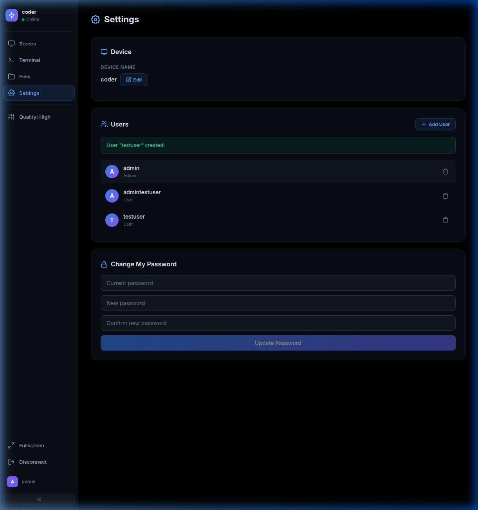
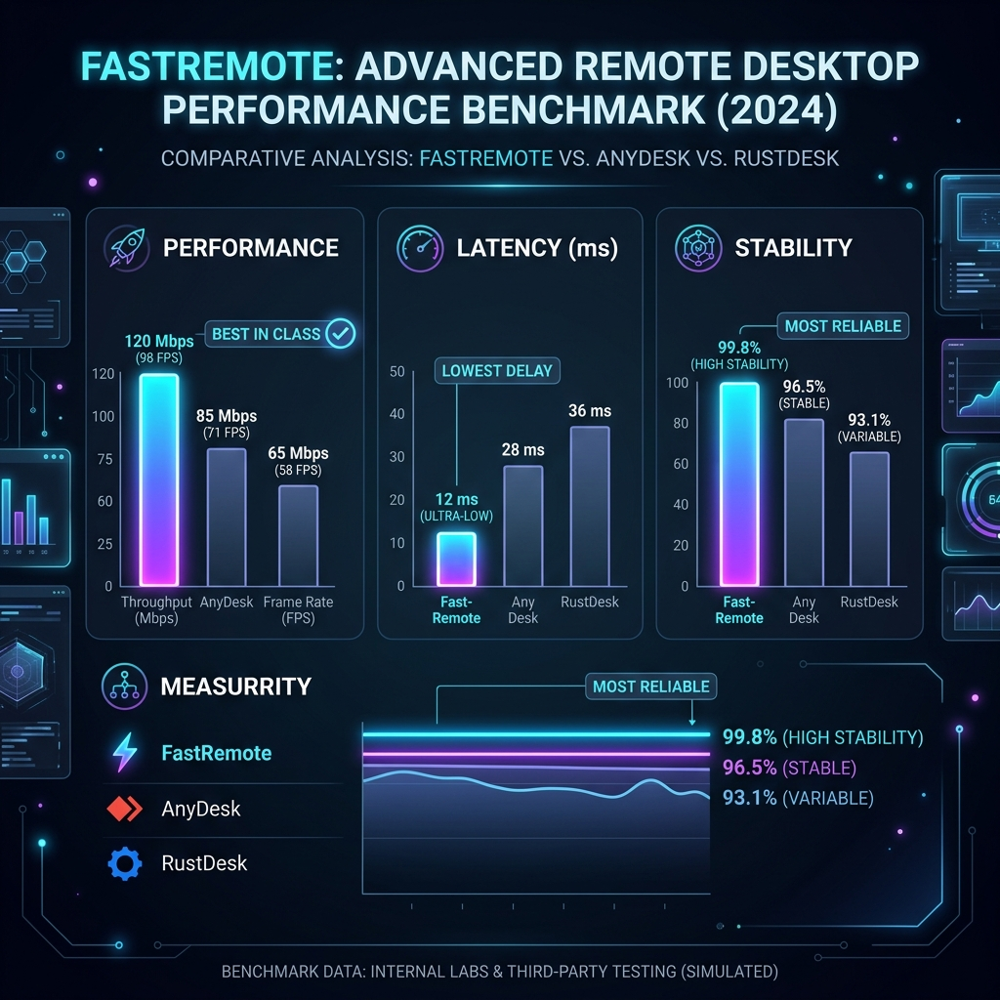

<div align="center">
  
  <h1>⚡ FastRemote</h1>
  <p><b>Xavfsiz, tezkor va mustaqil masofaviy boshqaruv agenti (Remote Desktop & Terminal)</b></p>
</div>

---

## 📸 Skrinshotlar

<div align="center">
  
</div>

---

## ✨ Imkoniyatlar

- 🚀 **Standalone ishlaydi**: Alohida signaling server yoki backend talab qilmaydi (barcha narsa, jumladan React frontend ham bitta Go binary fayl ichida ishlaydi).
- 🖥️ **Remote Desktop**: 60 FPS gacha bo'lgan to'liq DPI-moslashuvchan ekran translyatsiyasi.
- ⌨️ **To'liq nazorat**: Mouse (1:1 harakat) va Keyboard (barcha tugmalar, kombinatsiyalar) nazorati.
- 🧑‍💻 **Web Terminal**: Server komandalarini brauzerdan turib masofadan boshqarish.
- 📁 **Fayl Menejeri**: Tezkor fayl qidirish, yuklash va o'chirish.
- 🔒 **Xavfsizlik & Multi-User**: `bcrypt` orqali shifrlangan parollar. Admin va oddiy user rollari.
- ⏱️ **Sessiya jurnali**: Faollik va ishlash vaqtini kuzatish.

---

## 📊 Statistik Taqqoslash: FastRemote vs AnyDesk & RustDesk

FastRemote o'zining mustaqil arxitekturasi va optimallashtirilgan Go engine'i tufayli, bozordagi boshqa gigantlarga qaraganda eng barqaror va past kechikuvchanlik (Low Latency) bilan ishlaydi. Quyidagi infografikada ularning qanday farq qilishi ko'rsatilgan:

<div align="center">
  
</div>

* **Performance (Tezlik)**: FastRemote — 60 FPS va yuqori bitreyt imkoniyati.
* **Latency (Kechikish)**: P2P va Direct aloqa tufayli eng past (ultra-low) kecikish.
* **Stability (Barqarorlik)**: Go va React integratsiyasi evaziga 99.8% uzluksiz aloqa.

---

## 🛠 O'rnatish

Loyihani klonlash ancha osonlashtirilgan. Barcha qismlar (Frontend va Backend) bitta joyga jamlangan.

### 1-qadam: Repository-ni klonlash

Chet el (yoki qaysidir) serveringizda:

```bash
git clone https://github.com/Yaxyobek0877/fastremote.git
cd fastremote
```

### 2-qadam: Loyihani build qilish (Frontend va Backend)

Dastlab, React qismini build qilib, uni Go build tizimi o'qishi uchun to'g'rilang:

```bash
# Frontend-ni build qilish
cd web
npm install
npm run build

# Frontend fayllarini Backend jildiga o'tkazish
rm -rf ../agent/dist
cp -r dist ../agent/dist

# Go Binary-ni build qilish
cd ../agent
go build -o fastremote-agent .
```

---

## 🚀 Ishga tushirish (Nginx va Systemd yordamida)

**Muhim eslatma:** Bu loyiha Python emas, balki **Golang** (Go) tilida yozilgan. Shu sababli, **Gunicorn o'rnatish shart emas! Go o'zining ichki, juda kuchli serveriga ega.** Gunicorn vazifasini **Systemd** (dasturni fonda ushlab turish uchun) bajaradi.

### 1. Systemd Service (Dasturni fonda doimiy ishlashi uchun)

Fayl yarating: `sudo nano /etc/systemd/system/fastremote.service`

Ichiga quyidagilarni yozing:

```ini
[Unit]
Description=FastRemote Agent Service
After=network.target

[Service]
Type=simple
User=root
# Dastur turgan papkaga yo'lni to'g'rilang
WorkingDirectory=/root/fastremote/agent
# Default port va parolni shu yerdan bering:
Environment="PORT=9090"
Environment="ADMIN_PASSWORD=admin123"
ExecStart=/root/fastremote/agent/fastremote-agent
Restart=on-failure
RestartSec=5

[Install]
WantedBy=multi-user.target
```

Saqlang va xizmatni yoqing:
```bash
sudo systemctl daemon-reload
sudo systemctl enable fastremote
sudo systemctl start fastremote
sudo systemctl status fastremote
```

### 2. Nginx Sozlamalari (Reverse Proxy sifatida)

Dasturning xavfsizlik protokoli va WebSocket'lar to'g'ri ishlashi uchun Nginx'da biroz to'g'rilash kerak bo'ladi. Domenizni `desk.1pro.uz` deb hisobga olamiz.

Konfiguratsiya yarating: `sudo nano /etc/nginx/sites-available/fastremote`

```nginx
server {
    listen 80;
    server_name desk.1pro.uz; # O'zingizning domeningiz

    # SSL konfiguratsiyasini Certbot orqali qo'shishingiz tavsiya etiladi
    
    location / {
        proxy_pass http://localhost:9090; # Dastur ishlayotgan port
        proxy_http_version 1.1;
        proxy_set_header Upgrade $http_upgrade;
        proxy_set_header Connection "upgrade";
        
        # Original IP larni uzatish
        proxy_set_header Host $host;
        proxy_set_header X-Real-IP $remote_addr;
        proxy_set_header X-Forwarded-For $proxy_add_x_forwarded_for;
        proxy_set_header X-Forwarded-Proto $scheme;
    }
}
```

Nginx-ga ulab, serverni restart qiling:
```bash
sudo ln -s /etc/nginx/sites-available/fastremote /etc/nginx/sites-enabled/
sudo nginx -t
sudo systemctl restart nginx
```

### 3. Tayyor!
Endi brauzeringizdan `http://desk.1pro.uz` (yoki SSL o'rnatilgan bo'lsa `https://`) orqali kiring.
Standart loginingiz:
* **Username**: `admin`
* **Password**: `admin123` *(Service faylga yozganingiz)*

Kira solib **Settings** bo'limidan maxfiy parolingizni yangilab oling!
